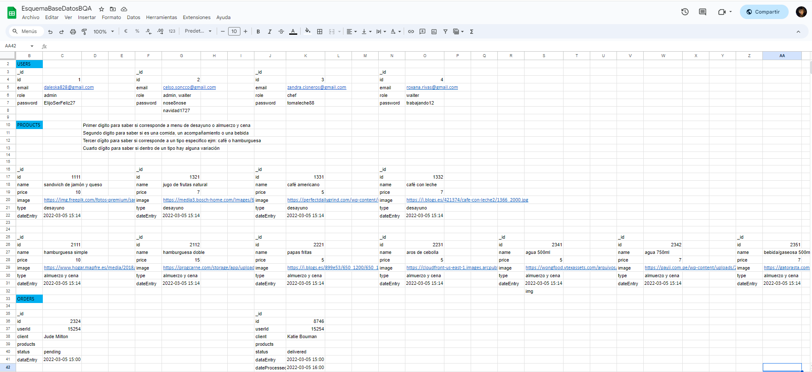

# BURGER QUEEN API - 💻🗳 API REST, Node js & MongoDB Atlas, Express 💚🗃

Puedes revisar la documentación completa de la API en Swagger. Encuentra detalles sobre cada endpoint y cómo interactuar con los servicios en el siguiente enlace: [Ir a Swagger](https://app.swaggerhub.com/apis-docs/ANDREASONCCOC/BurgerQueenAPI/1.0.1)

## Índice

* [1. Preámbulo](#1-pre%C3%A1mbulo)
* [2. Resumen del proyecto](#2-resumen-del-proyecto)
* [3. Conceptos tratados en el proyecto](#3-conceptos-tratados-en-el-proyecto)
* [4. Instrucciones de Instalación y Uso](#4-instrucciones-de-instalación-y-uso)
* [5. Proceso de Diseño y Desarrollo](#5-proceso-de-diseño-y-desarrollo)
* [6. Herramientas de Elaboración](#6-herramientas-de-elaboración)

## 1. Preámbulo

Un pequeño restaurante de hamburguesas, que está creciendo, necesita un
sistema a través del cual se puedan tomar pedidos usando una _tablet_, y enviarlos
a la cocina para que se preparen ordenada y eficientemente.

Este servicio tiene dos áreas: interfaz web (cliente) y API (servidor), el presente
proyecto aborda el desarrollo de la API.

## 2. Resumen del proyecto

El proyecto consiste en construir un servidor web, un programa al cual se puede
acceder en un puerto de red, que escucha consultas (request) y envia respuestas
(response) usando el protocolo HTTP y el formato JSON.

El stack utilizado para este programa es Node js y Express, complementado con un
motor de base de datos no relacional en MongoDB. Esta API Rest implica una arquitectura
de cliente/servidor conectada a MongoDB Atlas, haciendo uso de Operaciones CRUD para
administrar las colecciones de datos en **orders**, **products** y **users**.

En su desarrollo se utilizo **JWT** (_JSON Web Tokens_) **con una cookie** para
poder autenticar las cuentas de las usuarias y lograr la persistencia de datos de
inicio de sesión y finalmente el despligue del servidor web se hizo en **Vercel**.

## 3. CONCEPTOS TRATADOS EN EL PROYECTO

Stack **Node.js & Express**, **rutas** (_routes_), **URLs**, **HTTP** y **REST** (verbs, request, response,
headers, body, status codes...), **JSON**, **JWT** (_JSON Web Tokens_),
**conexión con una base datos** (`MongoDB`),
**variables de entorno** y **deployment**

## 5. PROCESO DE DISEÑO Y DESARROLLO.

### 5.1. Planificación y Diseño. ✏️

Para realizar el proyecto me organice utizando Github Project. De esta manera planifique mejor el tiempo y dividi el trabajo en metas por sprint usando `milestones` que contienen `issues` o tareas más pequeñas.Aplique metodología SCRUM de trabajo ágil.

Una parte del diseño de la API además de establecer la arquitectura como servidor/cliente fue la definición de los esquemas de los modelos de datos, que consistio en
describir de alguna forma la estructura de las colecciones que se uso y la forma de los objetos que se guardaron en dichas colecciones, para esto produje un esquema en excel donde reproduje la estructura de la base de datos teniendo en cuenta las 3 colecciones, sus elementos y respectivas propiedades.

[Ir al Esquema de la Base de Datos en Excel](https://docs.google.com/spreadsheets/d/1xJTZ-URxEsTb0OmiZAnuGRv3paYv_zBpTgnSxhVerBw/edit?usp=sharing)

**Esquema Planeado para MongoDB**
 

### 5.2. Desarrollo del Proyecto.

El desarrollo total de la libreria tomo cinco sprints y al cabo de cada uno fui tomando en cuenta el feedback recibido para hacer mejoras, a continuación pasaré a mostrar la imagen de mi tablero en Github Project donde guió el desarrollo por 5 hitos:

- Hito 1 ♟: Creación de la función mdLinks que devuelve una promesa con un arreglo de tres propiedades de los links

- Hito 2 💫: Agregar el argumento validate para agregar dos propiedades sobre validaciones HTTP

- Hito 3 📚: Leer directorios y no solo archivos

- Hito 4 ⌨️: Crear la interfaz de línea de comando

- Hito 5 ⭐️: Trabajar la recursividad de la función para leer directorios

**Tablero de Github Project**

**Cuadro de Milestones**

## 6. HERRAMIENTAS DE ELABORACIÓN

👩‍🔧💻
- JAVASCRIPT: para crear las funciones
- Node.js: como entorno de programación de JavaScript con sus Módulos `fs` y `path`
- Axios: Librería de Node.js para hacer las peticiones HTTP
- NPM (Node Package Manager): para crear la interfaz de línea de comando
- Terminal de Git Bash o PowerShell
- Jest: para testear las funciones sincronas y asincronas
- Github Project: para planificar el tiempo y dividir las tareas
- Diagrama de Flujo o Pseudocódigo en Microsoft Word