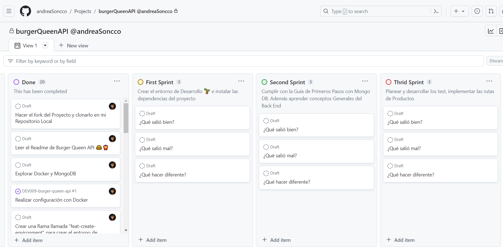
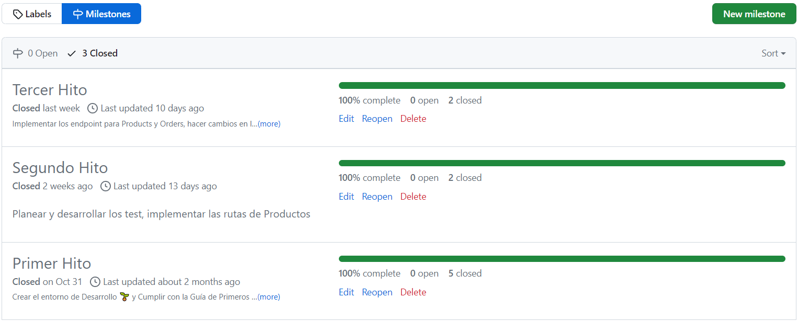

# BURGER QUEEN API - 💻🗳 API REST, Node js & MongoDB Atlas, Express 🗃

Para facilitar tu integración con el presente proyecto, te recomiendo revisar la documentación completa de la API en Swagger. Encuentra detalles sobre cada endpoint y cómo interactuar con los servicios en el siguiente enlace: [Ir a Swagger](https://app.swaggerhub.com/apis-docs/ANDREASONCCOC/BurgerQueenAPI/1.0.1)

## Índice

* [1. Preámbulo](#1-pre%C3%A1mbulo)
* [2. Resumen del proyecto](#2-resumen-del-proyecto)
* [3. Documentación de la Interfaz de Programación de Aplicaciones API](#3-documentación-de-la-interfaz-de-programación-de-aplicaciones-api)
* [4. Instrucciones de Instalación y Uso](#4-instrucciones-de-instalación-y-uso)
* [5. Proceso de Diseño y Desarrollo](#5-proceso-de-diseño-y-desarrollo)
* [6. Herramientas de Elaboración](#6-herramientas-de-elaboración)

## 1. Preámbulo


Un pequeño restaurante de hamburguesas, que está creciendo, necesita un
sistema a través del cual puedan tomar pedidos usando una _tablet_, y enviarlos
a la cocina para que se preparen ordenada y eficientemente.

Este servicio tiene dos áreas: interfaz web (cliente) y API (servidor), y el que
aborda el presente proyecto es desarrollar la API.

## 2. Resumen del proyecto

Con una API en este caso nos referimos a un _servidor web_, que es
básicamente un programa que _escucha_ en un puerto de red, a través del cual
podemos enviarle _consultas_ (_request_) y obtener _respuestas_ (_response_)
usando el protocolo HTTP (o HTTPS).

Un servidor web debe _manejar_ consultas entrantes y producir respuestas a esas
consultas que serán enviadas de vuelta al _cliente_. Cuando hablamos de
_aplicaciones de servidor_, esto implica una arquitectura de _cliente/servidor_,
donde el cliente es un programa que hace consultas a través de una red (por
ejemplo el navegador, cURL, etc.), y el _servidor_ es el programa que recibe
estas consultas y las responde.

[Node.js](https://nodejs.org/) nos permite crear servidores web súper eficientes
de manera relativamente simple y todo esto usando JavaScript!

En este proyecto partimos de un _boilerplate_ que ya contiene una serie de
_endpoints_ (puntos de conexión o URLs) y nos piden completar la aplicación.
Esto implica que tendremos que partir por leer la implementación existente, y
familiarizarnos con el _stack_ elegido ([Node.js](https://nodejs.org/) y
[Express](https://expressjs.com/)) y complementarlo con un motor de bases de
datos. Recomendamos el uso de [MongoDB](https://www.mongodb.com/) y tenemos una
[guía para empezar con MongoDB](./guides/GETTING-STARTED-MONGODB.md).

La clienta nos ha dado un [link a la documentación](https://app.swaggerhub.com/apis-docs/ssinuco/BurgerQueenAPI/2.0.0)
que especifica el comportamiento esperado de la API que expondremos por
HTTP. Ahí puedes encontrar todos los detalles de qué _endpoints_ debe
implementar la aplicación, qué parámetros esperan, qué deben responder, etc.

El objetivo principal de aprendizaje es adquirir experiencia con **Node.js**
como herramienta para desarrollar _aplicaciones de servidor_, junto con una
serie de herramientas comunes usadas en este tipo de contexto (Express como
framework, MongoDB como base datos, etc).

En este proyecto tendrás que construir un servidor web que debe _servir_ `JSON`
sobre `HTTP`, y desplegarlo en un servidor en la nube.

Para completar el proyecto tendrás que familiarizarte con conceptos como
**rutas** (_routes_), **URLs**, **HTTP** y **REST** (verbs, request, response,
headers, body, status codes...), **JSON**, **JWT** (_JSON Web Tokens_),
**conexión con una base datos** (`MongoDB`),
**variables de entorno**, **deployment**, etc.

## 3. DOCUMENTACIÓN DE LA INTERFAZ DE PROGRAMACIÓN DE APLICACIONES API.

  🗂
  En este proyecto se decidió utilizar ES Modules con la síntaxis `import` / `export`, ya que
  es una versión más actual y se necesito hacer algunos pasos adicionales de configuración
  como instalar babel y modificar el package.json.

  Para poder trabajar con las rutas y crear las funciones del código se hizo uso de los modulos
  de Node.js como `fs` y `path`, usando principalmente `readFile` para leer archivos de forma
  asíncrona y `readdirSync` para leer directorios de forma síncrona.

  También se instalo y aplico el módulo de Axios para poder hacer las peticiones HTTP y generar
  las validaciones gracias a las propiedades `status` y `statusText`

  Al final del proyecto se testeo las funciones puras y la función general `mdLinks(path, validate)`
  luego de instalar jest y aplicar el test Mock para el módulo de Axios.

## 4. INSTRUCCIONES DE INSTALACIÓN Y USO.

### 4.1. Instalación 👩🏽‍💻

Esta librería está disponible de dos formas: como un módulo publicado
en GitHub, que las usuarias pueden instalar e importar en otros proyectos, y como
una interfaz de línea de comandos (CLI) que permitirá utilizar la librería directamente
desde el terminal.

Se puede instalar esta librería utilizando NPM (Node Package Manager), desde tu terminal puedes utilizar cualquiera de los siguientes comandos:

- ```npm install andreaSoncco/DEV009-md-links```

- ```npm install md-links andrea```

### 4.2. Guía de Uso 📋💻

#### 4.2.1. Obtener arreglo con propiedades de los links 🖇
Al ejecutar el siguiente comando:

  ```md-links ./firstDirectory```

Se obtendrá un arreglo de objetos con las propiedades:

* `href`: URL encontrada.
* `text`: Texto que aparecía dentro del link (`<a>`).
* `file`: Ruta del archivo donde se encontró el link.

```shell
[
  {
    href: 'https://es.wikipedia.org/wiki/Markdownu',
    text: 'Markdown',
    file: 'thirdFile.md'
  },
  {
    href: 'https://curriculum.laboratoria.la/es/topics/javascript/03-functions/02-arrow',
    text: 'Arrow Functions',
    file: 'thirdFile.md'
  },
  {
    href: 'https://curriculum.laboratoria.la/es/topics/javascript/03-functions/02-arrow',
    text: 'Arrow Functions',
    file: 'firstFile.text'
  },
  {
    href: 'https://github.com/markedjs/marked',
    text: 'marked',
    file: 'SecondFile.markdown'
  }
]
```
#### 4.2.2. Obtener arreglo con propiedades y validaciones de los links 🖇✅
Para esto se utiliza el argumento `--validate` y se ejecutar el siguiente comando:

  `md-links ./firstDirectory --validate`

Obtendremos un arreglo de objetos con las propiedades:

* `href`: URL encontrada.
* `text`: Texto que aparecía dentro del link (`<a>`).
* `file`: Ruta del archivo donde se encontró el link.
* `status`: Código de respuesta HTTP.
* `ok`: Mensaje `fail` en caso de fallo de lo contrario `ok` en caso de éxito.

```shell
  [
  {
    href: 'https://curriculum.laboratoria.la/es/topics/javascript/03-functions/02-arrow',
    text: 'Arrow Functions',
    file: 'firstFile.text',
    status: 200,
    ok: 'ok'
  },
  {
    href: 'https://es.wikipedia.org/wiki/Markdownu',
    text: 'Markdown',
    file: 'thirdFile.md',
    status: 404,
    ok: 'fail'
  },
  {
    href: 'https://curriculum.laboratoria.la/es/topics/javascript/03-functions/02-arrow',
    text: 'Arrow Functions',
    file: 'thirdFile.md',
    status: 200,
    ok: 'ok'
  },
  {
    href: 'https://github.com/markedjs/marked',
    text: 'marked',
    file: 'SecondFile.markdown',
    status: 200,
    ok: 'ok'
  }
]

```

#### 4.2.3. Obtener estadísticas de los Links 🧮
Para esto se utiliza el argumento `--stats` y se ejecuta el siguiente comando:

  `md-links ./firstDirectory --stats`

Al utilizar esta opción, podrás obtener estadísticas relacionadas con los enlaces presentes en los archivos Markdown.

```sh
Total: 4
Unique: 3
```

* Los `links Total` representan la cantidad total de enlaces encontrados en los archivos analizados. Cada enlace único se suma, incluso si aparece varias veces en diferentes archivos.

* Los `links Unique` muestran la cantidad de enlaces distintos presentes en los archivos Markdown. Si un mismo enlace aparece en varios archivos, solo se contará una vez en esta métrica.

Utiliza esta opción para obtener una visión general de la cantidad total de enlaces y la diversidad de enlaces únicos en tus documentos Markdown.

#### 4.2.4. Obtener estadísticas y contar los links rotos ❌
Para esto se utiliza el argumento `--validate` y `--stats`, se ejecuta el siguiente comando:

  `md-links ./firstDirectory --validate --stats`

También podemos combinar `--validate` y `--stats` para obtener estadísticas que necesiten de los resultados de la validación.

```sh
Total: 4
Unique: 3
Broken: 1
```

* `Broken:` El número de enlaces que están rotos o que no devuelven un mensaje de ok

## 5. PROCESO DE DISEÑO Y DESARROLLO.

### 5.1. Planificación y Diseño. ✏️

Para realizar el proyecto me organice utizando Github Project. De esta manera planifique mejor el tiempo y dividi el trabajo en metas por sprint usando `milestones` que contienen `issues` o tareas más pequeñas.Aplique metodología SCRUM de trabajo ágil.

Para el desarrollo de la libreria y teniendo en cuenta que se debia pensar en la Interfaz de Programación de Aplicaciones API realice un Diagrama de Flujo o Pseudocódigo 💡 que me ayudo a poder ordenarme respecto a las funciones que se necesitaban crear y codear la totalidad del proyecto.

[Ir al Diagrama de Flujo o Pseudocódigo de mdLinks: ](https://drive.google.com/file/d/1AXoFnJ6bVQXE7URR6OiYP7XmP8JzJUFA/view?usp=sharing)

**Diagrama de Flujo Primera Parte**


**Diagrama de Flujo Segunda Parte**


### 5.2. Desarrollo del Proyecto.

El desarrollo total de la libreria tomo cinco sprints y al cabo de cada uno fui tomando en cuenta el feedback recibido para hacer mejoras, a continuación pasaré a mostrar la imagen de mi tablero en Github Project donde guió el desarrollo por 5 hitos:

- Hito 1 ♟: Creación de la función mdLinks que devuelve una promesa con un arreglo de tres propiedades de los links

- Hito 2 💫: Agregar el argumento validate para agregar dos propiedades sobre validaciones HTTP

- Hito 3 📚: Leer directorios y no solo archivos

- Hito 4 ⌨️: Crear la interfaz de línea de comando

- Hito 5 ⭐️: Trabajar la recursividad de la función para leer directorios

**Tablero de Github Project**



**Cuadro de Milestones**



## 6. HERRAMIENTAS DE ELABORACIÓN

👩‍🔧💻
- JAVASCRIPT: para crear las funciones
- Node.js: como entorno de programación de JavaScript con sus Módulos `fs` y `path`
- Axios: Librería de Node.js para hacer las peticiones HTTP
- NPM (Node Package Manager): para crear la interfaz de línea de comando
- Terminal de Git Bash o PowerShell
- Jest: para testear las funciones sincronas y asincronas
- Github Project: para planificar el tiempo y dividir las tareas
- Diagrama de Flujo o Pseudocódigo en Microsoft Word